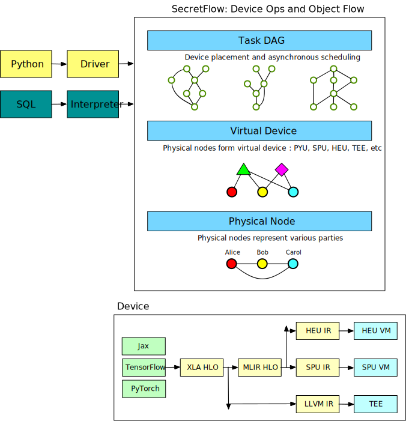
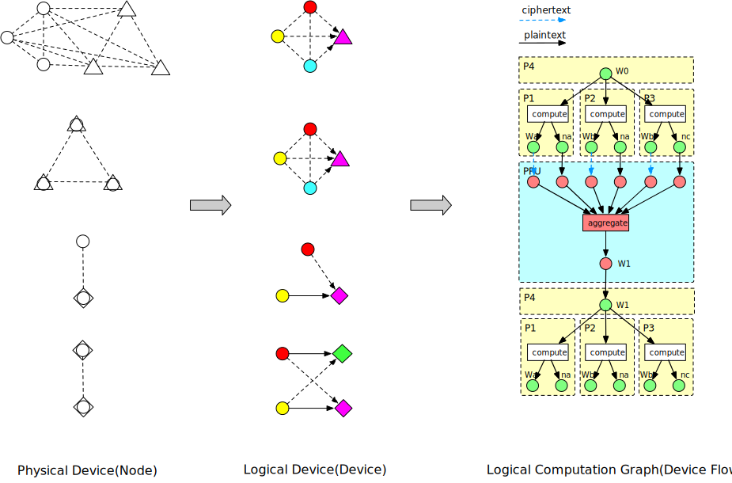
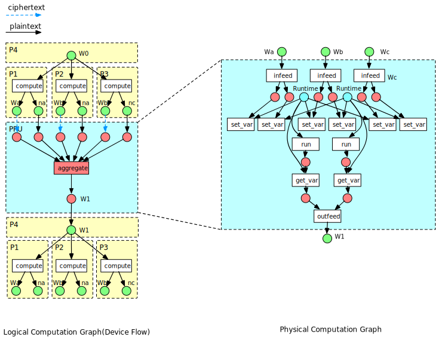

# 隐语(SecretFlow)

隐语是一个开放的隐私保护数据分析和机器学习框架。



## 设计思想

隐私计算是一个新兴的跨学科领域，涉及密码学、机器学习、数据库、硬件等多个领域。根据过去几年的实践经验，我们发现

1. 没有一种隐私计算技术可以适用于所有的场景
2. 隐私计算学习曲线很高，其他背景用户使用困难
3. 隐私计算涉及领域众多，需要领域专家共同协作

隐语的设计目标是使得数据科学家和机器学习开发者可以非常容易地使用隐私计算技术进行数据分析和机器学习建模，而无需了解底层技术细节。 为了达到这个目标，隐语提供了一层设备抽象，将多方安全计算(MPC)、同态加密(HE)和可信执行环境(TEE)
等隐私计算技术抽象为密文设备， 将单方计算抽象为明文设备。基于这层抽象，数据分析和机器学习工作流可以表示为一张计算图，其中节点表示某个设备上的计算，边表示
设备之间的数据流动，不同类型设备之间的数据流动需要进行协议转换。在这一点上，隐语借鉴了主流的深度学习框架，后者将神经网络表示为 一张由设备上的算子和设备间的张量流动构成的计算图。

隐语是一个开放的框架，面向不同层次的开发者。在设备层，我们与密码学、可信硬件、硬件加速等领域专家通力合作，不断提升协议安全、计算性能。
同时，隐语提供了良好的设备接口，第三方隐私计算协议可作为设备插拔式接入。在算法层，为机器学习提供了灵活的编程接口，算法开发者可以很容易 定义自己的算法。

## 设备

隐语的设备分为物理设备和逻辑设备，其中，物理设备是隐私计算各个参与方的物理机器，逻辑设备则由一个或多个物理设备构成。逻辑设备支持一组 特定的计算算子(Device Ops)，有自己特定的数据表示(Device Object)
。逻辑设备分为明文和密文两种类型，前者执行单方本地计算，后者执行 多方参与的隐私计算。

逻辑设备的运行时负责内存管理、数据传输、算子调度等职责，运行在一个或多个物理设备上。逻辑设备和物理设备不是一对一的关系，一个物理设备 可能同时属于多个逻辑设备。在同一组物理设备上，可以根据不同的隐私协议和参与组合虚拟出不同的逻辑设备。



下表是隐语目前暂定支持的设备列表：

| 设备   | 类型  | 运行时                | 算子           | 协议            | 前端                       | 状态      |
|------|-----|--------------------|--------------|---------------|--------------------------|---------|
| PYU  | 明文  | Python Interpreter | —            | —             | Python                   | Release |
| PPU  | 密文  | PPU VM             | PSI, XLA HLO | SPDZ-2k, ABY3 | JAX, TensorFlow, PyTorch | Alpha   |
| PHEU | 密文  | PHEU Runtime       | Add          | Paillier, OU  | Numpy                    | WIP     |
| FHEU | 密文  | FHEU VM            | XLA HLO      | TFHE          | JAX, TensorFlow, PyTorch | Alpha   |
| TEE  | 密文  | TEE Runtime        | XLA HLO      | Intel SGX     | JAX, TensorFlow, PyTorch | WIP     |

### 可编程性

逻辑设备具备可编程性，即用户可以在设备上自定义计算逻辑，每个设备对用户提供了协议无关的编程接口。在一个设备上，用户可以定义从简单的矩阵运算， 到完整的深度模型训练，甚至任意执行逻辑。当然，这一切取决于设备提供的计算能力。

对于明文设备PYU，它的前端为python，用户可以通过`@device`将任意一段python函数调度至其上执行。 这些函数经过`cloudpickle`序列化、传输、反序列化，由目标设备的python解释器执行。

对于密文设备PPU、FHEU、TEE，它们的前端可以是任何支持[XLA](https://www.tensorflow.org/xla/architecture) 的框架， 如JAX, TensorFlow,
PyTorch等。同样的，用户也可以通过`@device`将基于这些前端自定义的函数调度至指定的设备执行。

```python
import jax.numpy as jnp

dev = Device()  # maybe PYU, PPU, FHEU, TEE


@device(dev)
def selu(x, alpha=1.67, lmbda=1.05):
    return lmbda * jnp.where(x > 0, x, alpha * jnp.exp(x) - alpha)


res = selu(x)  # res is a DeviceObject
```

用户自定义函数首先转换成XLA HLO Computation，由XLA进行设备无关的代码优化和分析，并发往后端设备。后端设备进一步执行代码优化和分析，并生成最终 的可执行代码。可执行代码或由设备的虚拟机解释执行(PPU, FHEU)
，或由硬件直接执行(TEE)。使用XLA HLO作为IR，使得我们可以复用XLA前端和设备无关 代码优化，同时使得后端实现更加简洁干净。

对于密文设备PHEU，它仅支持一组有限的计算，因此提供了一组预定义算子如`__add__`, `__mul__`等，用户不能通过`@device`进行自定义编程。

```python
x, y = HEUObject(), PYUObject()
z = x + y  # add
z = x * y  # mul
z = x @ y  # matmul
```

关于逻辑设备的更多细节，请参考各个设备的设计文档。

### 协议转换

用户在逻辑设备上进行编程，构建逻辑计算图，其节点表示设备上的一段函数或算子，边表示设备对象的流动。逻辑计算图被设备进一步分割为子图，两个子图间的 边表示跨设备的对象流动，此时需要进行协议转换。设备对象的`DeviceObject.to`
接口用于转换至目标设备对象，任何新增的设备都应该提供相应的转换函数并 插入对象转换表中。

下表是各个逻辑设备对象的转换表：

|     | PYU         | PPU           | HEU             | TEE                 |
|-----|-------------|---------------|-----------------|---------------------|
| PYU |             | share         | encrypt         | encrypt             |
| PPU | reconstruct |               | encrypt+add     | reconstruct+encrypt |
| HEU | decrypt     | minus+decrypt |                 | decrypt+encrypt     |
| TEE | decrypt     | decrypt+share | decrypt+encrypt |                     |

## 通信调度

用户基于设备构建了一张逻辑计算图，那么我们如何执行这张计算图？由于逻辑设备映射到一个或多个物理设备，因此我们需要将逻辑设备上的算子正确调度到
其对应的物理设备，同时处理好这些物理设备间的数据传输关系。毫无疑问，我们需要一个分布式图执行引擎来解决这些问题。

那么我们需要一个怎样的分布式图执行引擎？以下是隐语对它的要求

- 细粒度的异构计算：在一张逻辑计算图中，具有不同粒度的计算任务，既有简单的数据处理（秒级），也有复杂的多方训练（几个小时至几十小时）。 同时，物理节点具有不同的硬件环境，CPU, GPU, TEE, FPGA等。
- 灵活的计算模型：在水平、垂直场景下，针对数据处理和模型训练等不同工作流，支持多种并行模型，如数据并行、模型并行、混合并行。
- 动态执行：在联邦学习场景下，不同机构的数据规模、带宽延迟、机器性能可能有较大差异，这导致同步模式的效率受限于最慢的工作节点。因此，我们希望支持 异步训练模式，这要求图执行引擎具有动态执行能力。

我们综合评估了业界几个流行的分布式框架

- [Dask](http://distributed.dask.org/en/stable/)
- [Ray](https://docs.ray.io/en/latest/)
- [TensorFlow Distributed](https://www.tensorflow.org/guide/distributed_training)
- [PyTorch Distributed](https://pytorch.org/tutorials/beginner/dist_overview.html)

最终我们选择了Ray作为隐语的分布式引擎，它非常好地满足了隐语的上述需求。Ray提供的分布式原语使得逻辑设备上的任务调度和数据传输 可以很容易地映射到物理设备。Ray提供的异步调度和动态执行能力使得计算图的执行更加灵活、高效。



Ray是适用于局域网环境的分布式系统，要将其应用于隐私计算场景，需要做许多安全加固和环境适配工作。我们正在与蚂蚁计算智能Ray内核团队展开深入合作，打造一个安全可靠的、适合隐私计算的Ray框架。

在安全加固方面，我们通过身份认证、代码预装、代码存证等手段对框架做了整体加固。未来，我们还将探索沙箱隔离、访问控制、静态图等机制以进一步加强Ray的安全水位。在环境适配方面，为了适配跨机构网络通信的特点，我们推进了GCS
gRPC通信、域名支持、弱网断线处理等相关功能的开发。同时，我们也在探索Ray生态，如Mars, Ray Datasets, Ray Train等，在隐私计算场景的使用。

## 隐私算法

逻辑设备抽象为算法开发者提供了极大的灵活性，他们可以像积木一样自由组合这些设备，在设备上自定义计算，从而构建自己的隐私计算算法。

以下是我们设备编程构建的一些算法

- 在PPU、FHEU上进行逻辑回归、深度学习训练
- 使用PPU, HEU的组合构建[HESS-LR](https://dl.acm.org/doi/10.1145/3447548.3467210)
  , [HESS-XGB](https://dl.acm.org/doi/10.1145/3459637.3482361) 算法
- 水平联邦学习，在PYU进行本地训练，在PPU、TEE进行梯度、权重聚合
- 垂直拆分学习，将一个模型拆分至多个PYU，使用差分隐私保护前向隐层和反向梯度

关于这些算法的细节，请参考我们的教程和实现，也期待您基于隐语开发出更多有趣的算法！